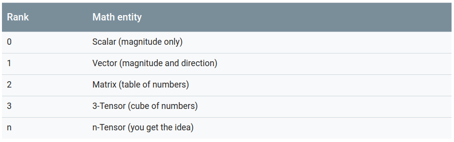
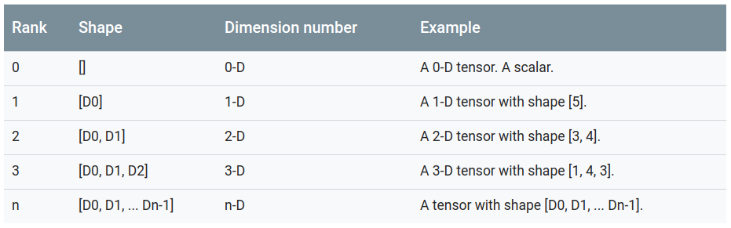

# 1. Introduction
* Manage TensorFlow program (`tf.Graph`)
* Run TensorFlow operations ('tf.Session')

## 1.1 Tensor Values
* `tensor`: a tensor consists of a set of primitive values shaped into an array of any number of dimentions.
    (**rank**, **shape**)

    `TensorFlow uses numpy arrays to represent tensor values.`

## 1.2 TensorFlow Core Walkthrough
    1. Building the computational graph (a `tf.Graph`).
    2. Running the computational graph (using a `tf.Session`).

* Graph:
    A computational graph is a series of TensorFlow operations arranged into a graph.
    The graph is composed of two types of objects: `tf.Operation` + `tf.Tensor`
    `tf.Operation` --> `nodes`
    `tf.Tensor` --> `edges`
    **Each operation in a graph is given a unique name.**
* TensorBoard
    ```
    # Save the computation graph to a TensorBoard summary file:
    writer = tf.summary.FileWriter('.')
    writer.add_graph(tf.get_default_graph())
    writer.flush()
    # Launch TensorBoard:
    tensorboard --logdir .
    ```
* Session
    To evaluate tensors, instantiate a `tf.Session` object, informally known as a **session**.
* Feeding
    ```
    print(sess.run(z, feed_dict={x: 3, y: 4.5}))
    print(sess.run(z, feed_dict={x: [1, 3], y: [2, 4]}))
    ```
* Datasets
    Placeholders work for simple experiments, but tf.data are the preferred method of streaming data into a model.
    To get a runnable `tf.Tensor` from a Dataset you must first convert it to a `tf.data.Iterator`, and then call the Iterator's `tf.data.Iterator.get_next` method.
## 1.3 Layers
    A trainable model must modify the values in the graph to get new outputs with the same input. `tf.layers` are the preferred way to add trainable parameters to a graph.
* Creating Layers
* Initializing Layers
## 1.4 Feature columns
## 1.5 Training
* Define the data
* Define the model
* Loss
* Training

---
# 2. Tensors
A `tensor` is a generalization of vectors and matrices to potentially higher dimensions.
Internally, TensorFlow represents tensors as n-dimensional arrays of base datatypes.    <br />
A `tf.Tensor` has the following properties: <br />
    * 1. a data type    <br />
    * 2. a shape        <br />
Some types of tensors are special:  <br />
    * `tf.Variable`     <br />
    * `tf.constant`     <br />
    * `tf.placeholder`  <br />
    * `tf.SparseTensor` <br />

## 2.1 Rank
The `rank` of a `tf.Tensor` object is its number of dimensions. <br />

* Getting a `tf.Tensor` object's rank
To determine the rank of a `tf.Tensor` object, call the `tf.rank` method.
* Referring to `tf.Tensor` slices

## 2.2 Shape
The **shape** of a tensor is the number of elements in each dimension.
* Getting a `tf.Tensor` object's shape

    * Shapes can be represented via Python lists/tuples of ints, or with the `tf.TensorShape`.
    * Two ways:
        * `tf.Tensor.shape`
        * `tf.shape(tf.tensor)`
* Changing the shape of a `tf.Tensor`
    * `tf.reshape()`

## 2.3 Data types
## 2.4 Evaluating Tensors
* The simplest way to evaluate a Tensor: `Tensor.eval()`, which only works when a default `tf.Session` is active.
## 2.5 Printing Tensors
* `tf.Print()`


---
# 3. Variables
A TensorFlow `variable` is the best way to represent shared, persistent state manipulated by your program.
## 3.1 Creating a Variable
* The best way to create a variable is to call the tf.get_variable function.
    ```
    my_variable = tf.get_variable("my_variable", [1, 2, 3])
    my_int_variable = tf.get_variable("my_int_variable", [1, 2, 3], dtype=tf.int32, initializer=tf.zeros_initializer)
    ```
## 3.2 Initializing variables
Because disconnected parts of a TensorFlow program might want to create variables, it is sometimes useful to have a single way to access all of them. For this reason TensorFlow provides **collections**.
By default every `tf.Variable` gets placed in the following two collections:
* `tf.GraphKeys.GLOBAL_VARIABLES` --- variables that can be shared across multiple devices,
* `tf.GraphKeys.TRAINABLE_VARIABLES` --- variables for which TensorFlow will calculate gradients. <br />

If you don't want a variable to be trainable, add it to the tf.GraphKeys.LOCAL_VARIABLES collection instead.
* The following snippet demonstates how to add variable named `my_local` to this collection.
    ```
    my_local = tf.get_variable("my_local", shape=(), collections=[tf.GraphKeys.LOCAL_VARIABLES])

    ```
* Device placement

## 3.3 Using variables
## 3.4 Sharing variables

---
# 4. Graphs and Sessions
TensorFlow uses a **dataflow graph** to represent your computation in terms of the dependencies between individual operations.
Dataflow has several advantages:
* Parallelism
* Distributed execution
* Compilation
* Portability

## 4.1 What is a `tf.Graph`
A `tf.Graph` contains two relevant kinds of information:
* Graph structure: The nodes and edges of the graph.
* Graph collections: TensorFlow provides a general mechanism for storing collections of metadata in a `tf.Graph`.

## 4.2 Building a `tf.Graph`
Most TensorFlow programs start with a dataflow graph construction phase.
In this phase, you invoke TensorFlow API functions that construct new `tf.Operation` (node) and `tf.Tensor` (edge) objects and add them to a `tf.Graph` instance.

## 4.3 Naming operations
A `tf.Graph` object defines a `namespace` for the `tf.Operation` objects it contains.
A tensor name has the form `<OP_NAME>:<i>` where:
* `<OP_NAME>` is the name of the operation that produces it;
* `<i>` is an integer representing the index of that tensor among the operation's outputs.

## 4.4 Placing operations on different devices
A **device specification** has the following form:  <br />
```
/job:<JOB_NAME>/task:<TASK_INDEX>/device:<DEVICE_TYPE>:<DEVICE_INDEX>
```
where:
* `<JOB_NAME>` is an alpha-numeric string that does not start with a number.
* `<DEVICE_TYPE>` is a registered device type (such as GPU or CPU).
* `<TASK_INDEX>` is a non-negative integer representing the index of the task in the job named <JOB_NAME>. See tf.train.ClusterSpec for an explanation of jobs and tasks.
* `<DEVICE_INDEX>` is a non-negative integer representing the index of the device, for example, to distinguish between different GPU devices used in the same process.

## 4.5 Executing a graph in a `tf.Session`
* Creating a `tf.Session`
* Using `tf.Session.run` to execute operations

## 4.6 Visualizing your graph
`tf.summary.FileWriter`


---
# 5. Save and Restore
The `tf.train.Saver` class provides methods to save and restore models.

## 5.1 Save and restore variables
`Saver` restores all variables already defined in model.
* Save variables    <br />
    Create a **Saver** with `tf.train.Saver()` to manage all variables in the model.
* Choose variables to save and restore      <br />
    If you do not pass any arguments to `tf.train.Saver(), the saver handles all variables in the graph. Each variable is saved under the name that was passed when the variable was created.   <br />
    It is also sometimes useful to only save or restore a subset of the variables used by a model.  <br />
* Inspect variables in a checkpoint     <br />

## 5.2 Save and restore models

## 5.3 Build and load a SavedModel

## 5.4 Using SavedModel with Estimators


# 6. Control Flow
> [AutoGraph](https://github.com/tensorflow/tensorflow/tree/master/tensorflow/python/autograph) helps you write complicated graph code using normal Python.
Behind the scenes, AutoGraph automatically transforms your code into the equivalent `TensorFlow graph code`.

## 6.1 Automatically convert Python control flow
1. Write code in python and then convert to tensorflow version.

## 6.2 Decorator
> If you don't need easy access to the original Python function, use the `convert` decorator.

##