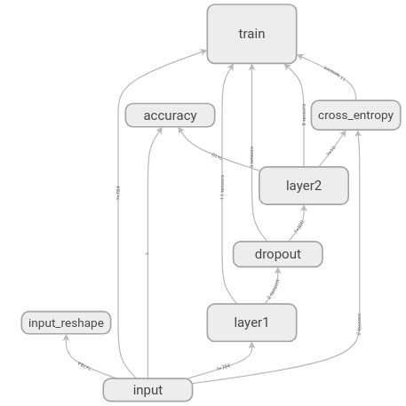

> TensorBoard operates by reading TensorFlow events files, which contain summary data that you can generate when running TensorFlow.

1. First, create the TensorFlow graph that you'd like to collect summary data from,
and decide which nodes you would like to annotate with [summary operations](https://github.com/tensorflow/docs/tree/master/site/en/api_guides/python).

Operations in TensorFlow don't do anything until you run them, or an op that depends on their output. The summary nodes that we've just created are peripheral to the graph: none of the ops you are currently running depend on them.

2. Then, you can just run the merged summary op, which will generate a serialized `Summary` protobuf object with all of your summary data at a given step.

3. Finally, to write this summary data to disk, pass the summary protobuf to a `tf.summary.FileWriter`.

The `FileWriter` takes a `logdir` in its constructor - this logdir is quite important, it's the directory where all of the events will be written out. Also `FileWriter` can optionally take a `Graph` in its constructor.


# 1. TensorBoard: Visualizing Learning
## 1.1 Serializing the data
> TensorBoard operates by reading TensorFlow events files, which contain summary data that you can generate when running TensorFlow.
First, create the TensorFlow graph that you'd like to collect summary data from, and decide which nodes you would like to annotate with [summary operations](https://www.tensorflow.org/api_guides/python/summary).

For details on all of the summary operations available, check out the docs on [summary operations](https://github.com/tensorflow/docs/tree/master/site/en/api_guides/python).

Collect nodes which we are interested in by attaching `tf.summary.scalar`, `tf.summary.histogram`...

Then, you can just run the merged summary op, which will generate a serialized `Summary` protobuf object with all of your summary data at a given step.

Finnaly, to write this summary data to disk, pass the summary protobuf to a `tf.summary.FileWriter`.
The `FileWriter` takes a `logdir` in its constructor - this logdir is quite important, it's the directory where all of the events will be written out. Also, the `FileWriter` can optionally take a `Graph` in its constructor.

### Analysis:



In this graph, we can see 8 boxes: `input`, `input_reshape`, `layer`, `dropout`,
`layer2`, `accuracy`, `cross_entropy` and `train`. All of these eight boxes are defined in top
`tf.name_scope()`

e.g.
```
# Input placeholders.
with tf.name_scope('input'):
    x = tf.placeholder(tf.float32, [None, 784], name='x-input')
    y_ = tf.placeholder(tf.int64, [None], name='y-input')
```

# 2. TensorBoard: Graph Visualization
TensorFlow computation graphs are powerful but complicated. The graph visualization
can help you understand and debug them.

## 2.1 Name scoping and nodes
> To simplify, variable names can be scoped and the visualization uses this information
to define a hierarchy on the nodes in the graph. By default, only the top of this hierarchy is shown.

Grouping nodes by name scopes is critical to making a legible graph.

TensorFlow graphs have two kinds of connections: **data dependencies** and **control dependencies**.
*Data dependencies* show the flow of tensors between two ops and are shown as solid arrows,
while *control dependencies* use dotted lines.

As one aid to legibility, the visualization uses special icons for constant and summary nodes.
To summarize, here's a table of node symbols:


## 2.2 Tensor shape information
When the serialized `GraphDef` includes tensor shapes, the graph visualizer labels edges with tensor
dimensions, and edge thickness reflects total tensor size. To include tensor shapes in the `GraphDef`
pass the actual graph object (as in `sess.graph`) to the FileWriter when serializing the graph.

## 2.3 Runtime statistics
Confusing!!!

# 3. TensorBoard: Histogram Dashboard
Confusing??? What's the meaning of different curves.
